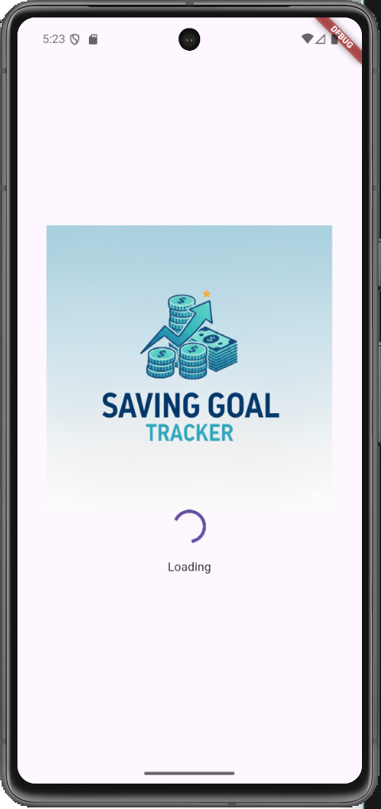
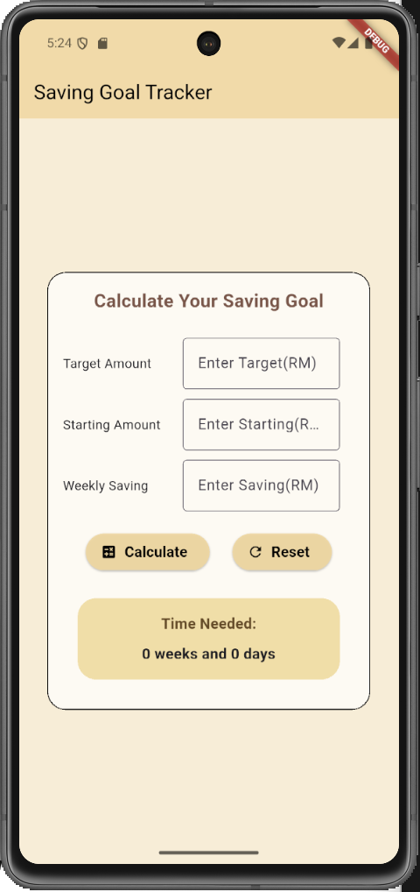
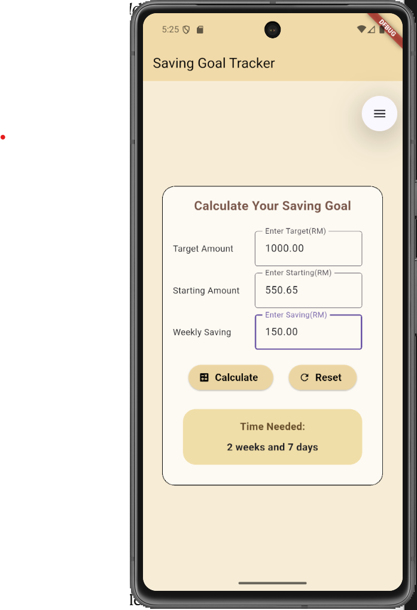

# saving_goal_tracker

APP NAME: Saving Goal Tarcker App 
NAME: NURUL NADHIRAH BINTI DZULKEFLI
MATRIC NO. : 301315

1.App Overview
The Saving Goal Tracker is a simple application that is use to calculate how long does it take to reach their saving goals. The calculation will be base on target amount, saving per week and starting balance where user can immediately see the number of weeks and days needed to reach their goals. Also, this app also perform a basic validation if user enter negative and empty input.

2.Input
-Target Amount (RM): 
    User enter the number of amount to be    saved.
-Starting Amount (RM): 
    User enter the starting saving balance that they have.
-Weekly Saving (RM): 
    User enter the amount that they want to saved every week.

3.Process
-Check validation 1:
    Check if field empty for each text. Using Show SnackBar(feedback message) for empty fields
-Check validation 2: 
    Check if value is -ve. Using Show SnackBar(feedback message) for -ve value 
-Calculate amount still needed: 
    double amountNeed = target - starting;
-Calculate total weeks needed:
    double totalWeeks = amountNeed/weekSaving;
-Separate into full weeks and remaining days:
    int fullWeeks = totalWeeks.floor(); //get whole no (2.5 = 2)
    double remainingWeeks = totalWeeks - fullWeeks; //get decimal
    int extraDays = (remainingWeeks * 7).round(); //convert to days

4.Output
-Time Needed: 
    X weeks and Y days

5.Widget list used
-Scaffold 
-AppBar
-Container
-Column
-Row
-Text
-TextField
-TextEditingController
-ElevatedButton
-SizedBox
-SingleChildScrollView
-SnackBar
-CircularProgressIndicato
-Image.asset
-FocusNode

6.Basic Validation Approach
-Check validation 1: Check if field empty for each text
    Using Show SnackBar(feedback message) for empty fields for target and weekSaving text fields
    if (target == 0 || weekSaving == 0){
        //Show SnackBar message : 'Please fill in all fields'
        //output/result set to 0
    }
-Check validation 2: Check if value is -ve.
    Using Show SnackBar(feedback message) for -ve value for all text fieldss
    if(target.isNegative || starting.isNegative || weekSaving.isNegative){
        //Show SnackBar message : 'Please enter positive value'
        //output/result set to 0
    }
-Safe Parsing
    use double.tryParse(controller.text) ?? 0 to all input
    To prevent crashes from non numeric value by defaulting to 0.

7.Screenshots
-Splash

-Home before

-Home after calculation

8.Authorship Note with signature 

    _________________________________
    (NURUL NADHIRAH BINTI DZULKEFLI , 301315 )
    “I confirm that this project represents my own original work in accordance with academic integrity policies. No part of the code was fully generated by AI tools such as ChatGPT or GitHub Copilot. I relied solely on lecture notes, class tutorials, and official Flutter documentation. I understand that my work may be scrutinized, and if it is found that I did not personally develop the code, marks may be deducted, or the submission may be disqualified.”

